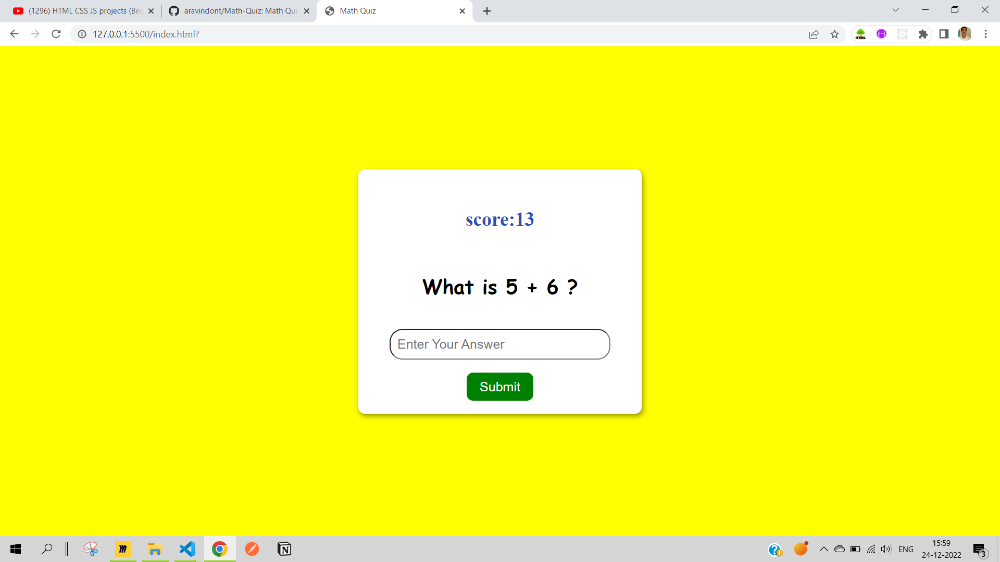

# Math Quiz

This App Asks simple questions around Math operations and if user gives correct answers `score` value will be increased by one and if user gives the wrong answer score value will be decreased by one.

`Let's Play`

## Kind of Wireframe :)


## HTML

- created the `index.html` file to write the `markup` for our app which is having the simple form with `input` and `submit` button.

```html
<!DOCTYPE html>
```

- Above Tag tells browsers to render the page in the standard format that is `HTML5` and simply we put `html` inside the tag.

## CSS

- To style the markup and to make it colorful we require `css`. I created the `styles.css` file and linked it to html by using the `link` tag

```html
<link rel="stylesheet" href="style.css" />
```

- I used pure `vanilla css` to write the styles for the page.

## JavaScript

I used the `Vanila JavaScript` to add the functionality to the page and used the `localStorage` to store and persist the `score` of the user.

ouput:


